```mermaid
sequenceDiagram
    autonumber

    participant User
    participant UI
    participant AgentAPI as Agent API Server
    participant Queue as BullMQ / Redis Queue
    participant Orchestrator as Run Orchestrator (BullMQ Worker)
    participant Memory as Memory Service
    participant Retrieval as Retrieval API
    participant LLM
    participant Tool as Tool Runtime / Tool Router
    participant Distiller as Memory Distiller (memory-extractor)

    %% --- User sends a message (non-blocking) ---
    User ->> UI: Type prompt ("do X")
    UI ->> AgentAPI: POST /assignments/{id}/messages (user message)
    AgentAPI ->> AgentAPI: Persist user message (append-only)
    AgentAPI ->> AgentAPI: Create run (status=queued, trigger_message_id)
    AgentAPI ->> Queue: Enqueue run.execute(run_id)
    AgentAPI -->> UI: 202 Accepted (run_id, stream_url)

    %% --- UI subscribes to streaming updates ---
    UI ->> AgentAPI: GET /runs/{run_id}/stream (SSE)
    AgentAPI -->> UI: SSE connected
    AgentAPI -->> UI: SSE run.status=queued

    %% --- Cancellation (can happen anytime) ---
    par User cancels (optional)
        User ->> UI: Cancel
        UI ->> AgentAPI: POST /runs/{run_id}/cancel
        AgentAPI ->> AgentAPI: Mark run cancel_requested=true
        AgentAPI -->> UI: 202 Accepted (cancel requested)
        AgentAPI -->> UI: SSE run.cancel_requested
    and Orchestrator continues until it checks cancellation
        Note over Orchestrator: Orchestrator checks cancel_requested between steps
    end

    %% --- Orchestrator starts the run ---
    Queue ->> Orchestrator: Dequeue run.execute(run_id)
    Orchestrator ->> Orchestrator: Acquire lock (e.g., per-assignment or per-run)
    Orchestrator ->> Orchestrator: If cancel_requested then cancel immediately
    alt cancel_requested before start
        Orchestrator ->> Orchestrator: Update run status=cancelled
        Orchestrator -->> AgentAPI: Emit run.status=cancelled
        AgentAPI -->> UI: SSE run.status=cancelled
        Orchestrator ->> Orchestrator: Release lock
    else run proceeds
        Orchestrator ->> Orchestrator: Update run status=running
        Orchestrator -->> AgentAPI: Emit run.status=running
        AgentAPI -->> UI: SSE run.status=running

        %% --- Load context ---
        Orchestrator ->> Orchestrator: Load assignment messages from DB

        %% --- Retrieval + Memory (advisory context) ---
        Orchestrator ->> Memory: POST /v1/memories/search (query=last user msg)
        Memory -->> Orchestrator: Top memories (ids, content, confidence)
        Orchestrator ->> Retrieval: POST /v1/retrieval/query (query=last user msg)
        Retrieval -->> Orchestrator: Top hits (chunk ids, sources, scores)
        Orchestrator ->> Orchestrator: Persist run snapshot (memories_used + retrieval_hits)
        Orchestrator -->> AgentAPI: Emit run.snapshot (counts, ids)
        AgentAPI -->> UI: SSE run.snapshot

        %% --- Planner phase (LLM call #1) ---
        Orchestrator ->> Orchestrator: Check cancel_requested
        alt cancel_requested during pre-plan
            Orchestrator ->> Orchestrator: Update run status=cancelled
            Orchestrator -->> AgentAPI: Emit run.status=cancelled
            AgentAPI -->> UI: SSE run.status=cancelled
            Orchestrator ->> Orchestrator: Release lock
        else continue
            Orchestrator ->> LLM: Plan (messages + memories + retrieval hits)
            LLM -->> Orchestrator: Structured plan (steps, tool intents)
            Orchestrator ->> Orchestrator: Persist plan (run_step #1)
            Orchestrator -->> AgentAPI: Emit plan.created
            AgentAPI -->> UI: SSE plan.created
        end

        %% --- Execution loop (LLM call #2, iterative) ---
        loop Until final OR max_steps OR cancelled
            Orchestrator ->> Orchestrator: Check cancel_requested
            alt cancel_requested mid-run
                Orchestrator ->> Orchestrator: Update run status=cancelled
                Orchestrator -->> AgentAPI: Emit run.status=cancelled
                AgentAPI -->> UI: SSE run.status=cancelled
            else continue
                Orchestrator ->> LLM: Execute next step (plan + observations)
                alt Tool required
                    LLM -->> Orchestrator: Tool call (name + args)
                    Orchestrator -->> AgentAPI: Emit tool.call
                    AgentAPI -->> UI: SSE tool.call

                    Orchestrator ->> Tool: Execute tool (policy checked)
                    Tool -->> Orchestrator: Tool output (stdout/stderr/structured)
                    Orchestrator ->> Orchestrator: Persist tool_call + tool_result
                    Orchestrator -->> AgentAPI: Emit tool.result (summary)
                    AgentAPI -->> UI: SSE tool.result
                    Orchestrator ->> Orchestrator: Append observation to context
                else Final answer
                    LLM -->> Orchestrator: Final response text
                    Orchestrator ->> Orchestrator: Persist assistant message (with provenance)
                    Orchestrator -->> AgentAPI: Emit message.created (assistant)
                    AgentAPI -->> UI: SSE message.created
                    Orchestrator ->> Orchestrator: Update run status=completed
                    Orchestrator -->> AgentAPI: Emit run.status=completed
                    AgentAPI -->> UI: SSE run.status=completed
                end
            end
        end

        %% --- Post-run: Distill memories (async, only if completed) ---
        alt run completed
            Orchestrator ->> Distiller: POST /v1/distill (transcript/run metadata)
            Distiller -->> Orchestrator: 202 Accepted (job queued)
            Orchestrator -->> AgentAPI: Emit distill.triggered
            AgentAPI -->> UI: SSE distill.triggered
        else run cancelled or failed
            Note over Orchestrator: Distillation skipped or handled differently (policy choice)
        end

        Orchestrator ->> Orchestrator: Release lock
    end
```

# Agent System Architecture (V2 - Run Orchestrator)

## Overview
This architecture separates the **Control Plane** (REST API, State Management) from the **Data Plane** (LLM Execution, Tool Runtime). This "Run Orchestrator" pattern ensures the system is scalable, observable, and resilient to failures, enabling long-running agent loops without blocking the user interface.

## 1. System Architecture

The system is composed of Kubernetes-native components communicating via **Queues** (Redis) and **APIs**.

```mermaid
graph TD
    User[User Client / UI] -->|POST Message & Run| API[Agent API Gateway]
    User -->|SSE Stream| API

    subgraph "Control Plane"
        API -->|Enqueue Run| Queue[Run Queue (Redis)]
        API -->|Read/Write| DB[(Postgres)]
    end

    subgraph "Data Plane"
        Orchestrator[Run Orchestrator] -->|Poll| Queue
        Orchestrator -->|Stream Events| PubSub[Redis PubSub]
        PubSub --> API
        
        Orchestrator -->|Inference| LLM[LLM Service (Ollama/vLLM)]
        Orchestrator -->|Execute| ToolRouter[Tool Router]
        Orchestrator -->|Context| Memory[Memory Service]
    end

    subgraph "Tooling Layer"
        ToolRouter -->|Fetch| Web[Web Tools]
        ToolRouter -->|Git/Code| Sandbox[Code Sandbox]
        ToolRouter -->|Query| VectorDB
    end
```

## 2. Component Design

### A. Agent API Gateway (Control Plane)
**Responsibility**: 
- Authenticated CRUD for Assignments, Messages, Runs, and Tools.
- Starts runs and streams progress via Server-Sent Events (SSE).
- Enforces multi-tenancy (Keycloak attributes).
- **Non-blocking**: `POST /messages` returns immediately (202 Accepted) with a `stream_url`.

**Key Endpoints**:
- `POST /v1/assignments/{id}/messages`: Accept user input, queue run.
- `GET /v1/assignments/{assignment_id}/runs/{id}/stream`: SSE endpoint for real-time tokens and tool events.
- `POST /v1/assignments/{assignment_id}/runs/{id}/cancel`: Stop an active run.

### B. Run Orchestrator (Data Plane)
**Responsibility**:
- The "Brain" of the operation. Consumes jobs from the Run Queue.
- executes the core ReAct / Planner loop:
  `INITIALIZE → RETRIEVE → PLAN → ACT (Tool) → OBSERVE → ... → FINALIZE`
- **Idempotency**: Guarantees that a run can be paused/resumed (in future).
- **Persistence**: Writes every `RunStep` and `ToolCall` to Postgres for replayability.

**Implementation**:
- Node.js Worker (BullMQ processor).
- Stateless (fetches context from DB at start of job).

### C. Tool Router (Safety Layer)
**Responsibility**:
- A centralized "Proxy" for all side-effects. 
- The Orchestrator *never* calls external APIs or executes code directly. It asks the Tool Router.
- Enforces strict security policies (e.g., "Only allow GET requests to these domains", "Code execution timout 5s").

**Security**:
- **Istio Policy**: Only the `tool-router` service has egress access to sensitive external services.
- **Secrets**: API keys are injected into the Tool Router, not the Orchestrator/LLM.

## 3. Data Model

### The "Run" Concept
A **Run** represents a single execution cycle triggered by a user message or an automated event.

- **Assignment**: The persistent conversation context.
- **Run**: A specific attempt to answer a request. Contains many **Steps**.
- **Run Step**: An atomic action (Reasoning Trace or Tool Call).

**Schema Overview**:
- `assignments`: Context holder.
- `runs`: Status (`queued`, `running`, `completed`), timestamps, snapshots.
- `run_steps`: The detailed audit log of the agent's thought process.
- `tool_calls`: Structured input/output for tools, distinct from text execution.

## 4. Execution Flow (Async Chat)

1.  **User Sends Message**:
    - Client POSTs to `/v1/assignments/:id/messages`.
    - API saves the `User Message` to DB.
    - API creates a `Run` record (status: `queued`).
    - API enqueues the Run ID to Redis.
    - API returns `202 Accepted` + `stream_url`.

2.  **Orchestrator Pickup**:
    - Worker grabs the job.
    - Fetches conversation history and relevant memories (`INITIALIZE`).
    - Emits `run.status = running` event.

3.  **Agent Loop**:
    - **Plan/Think**: Sends history to LLM. Streaming tokens are published to Redis PubSub -> API -> User Client.
    - **Decide Tool**: LLM requests `weather_api`.
    - **Execute Tool**: Orchestrator persists `ToolCall` and invokes `ToolRouter`.
    - **Observe**: ToolRouter returns JSON. Orchestrator appends result to context.
    - **Repeat**: Loop continues until LLM provides a final text answer.

4.  **Completion**:
    - Orchestrator saves `Assistant Message` to DB.
    - Updates `Run` status to `completed`.
    - Triggers **Memory Distiller** (async) to learn from the interaction.

## 5. Deployment & Build Order

**Namespace**: `bouc-agent`

1.  **Phase 1: Foundation**
    - `Postgres` (Assignments/Runs schema).
    - `Redis` (Queue/PubSub).
    - `Agent API` (CRUD + Mock Run Enqueue).

2.  **Phase 2: The Orchestrator**
    - `Run Orchestrator` Deployment (BullMQ Worker).
    - Basic Loop: History + LLM (No tools).
    - SSE Streaming implementation in API.

3.  **Phase 3: Tooling**
    - `Tool Router` Deployment.
    - Implement `http.fetch` and `web.search`.
    - Connect Orchestrator to Tool Router.

4.  **Phase 4: Advanced Capabilities**
    - Connect `Memory Service` (RAG).
    - Implement `Memory Distiller` for post-run learning.
    - Add `Code Sandbox` tool.